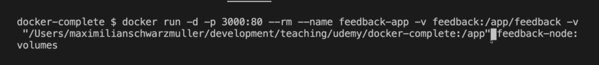

# Manage Data & Working With Volumes

- to build an image from dockerfile

  ```bash
    docker build -t feedback-node .
  ```

- to run a container from an image

  ```bash
    docker run -p 80:80 --name feedback-app --rm feedback-node
  ```

- after adding volumes to the container

  - build docker image from that dockerfile

    ```bash
      docker build -t feedback-node:volumes .
    ```

  - run the container from that image
    ```bash
      docker run -p 80:80 --rm --name feedback-app feedback-node:volumes
    ```

- to list volumes in docker

  ```bash
    docker volume ls
  ```

- passing volumes to the container

  ```bash
    docker run -p 80:80 --rm --name feedback-app -v feedback:/app/feedback feedback-node:volumes
  ```

# Bind Mounts ( Great For Persistent and editable data )

## Bind Mounts are used to share data between host and container

- to create a bind mount

  ```bash
    docker run -p 80:80 --rm --name feedback-app -v $(pwd):/app feedback-node:volumes
    docker run -d -p 80:80 --rm --name feedback-app -v feedback:/app/feedback -v "$(pwd):/app" feedback-node:volumes
  ```

  

- two approaches to use anonymous volumes

  - specifying in dockerfile
    add below line in docker file to use it as anonymous volume

    ```dockerfile
    VOLUME [ "/app/node_modules" ]
    ```

  - specifying in docker run command
    run below command to run container with anonymous volume
    ```bash
    docker run -d -p 80:80 --rm --name feedback-app -v feedback:/app/feedback -v "$(pwd):/app" -v /app/node_modules feedback-node:volumes
    ```

## Read Only Volumes

- to create a read only volume

  ```bash
    docker run -d -p 80:80 --rm --name feedback-app -v feedback:/app/feedback -v "$(pwd):/app:ro" -v /app/node_modules -v /app/temp feedback-node:volumes
  ```

# Arguments And Environment Variables

## Environment Variables

- building image

  ```bash
    docker build -t feedback-node:env .
  ```

- run container

  ```bash
    docker run -d -p 80:80 --rm --name feedback-app -v feedback:/app/feedback -v "$(pwd):/app:ro" -v /app/node_modules -v /app/temp feedback-node:env
  ```

- passing port number dynamically using --env flag

  ```bash
    docker run -d -p 80:3000 --rm --name feedback-app -v feedback:/app/feedback -v "$(pwd):/app:ro" -v /app/node_modules -v /app/temp --env PORT=3000 feedback-node:env
  ```

- using env file

  ```bash
    docker run -d -p 80:3000 --rm --name feedback-app -v feedback:/app/feedback -v "$(pwd):/app:ro" -v /app/node_modules -v /app/temp --env-file ./.env feedback-node:env
  ```

## build time arguments

- build image

  ```bash
    docker build -t feedback-node:build-arg .
  ```

- build image using build args

  ```bash
    docker build -t feedback-node:build-arg --build-arg DEFAULT_PORT=3000 .
  ```
